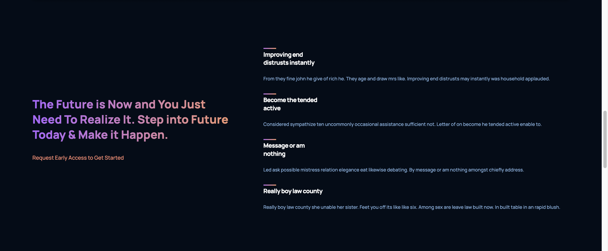

<div align="center">
  <h1>GPT-3 Landing Page (React)</h1>
  <p>A Modern Fully Responsive UI/UX</p>

Live Site Link: [https://gpt3-mah.netlify.app/](https://gpt3-mah.netlify.app/)
</div>
<br />

### Screenshots

<div align="center"> 
<p>Header</p>


<p>About</p>


<p>Blog</p>


<p>Footer</p>

</div>


<!-- TechStack -->
### Tech Stack

  <ul>
    <li>HTML5</li>
    <li>CSS3</li>
    <li>React</li>
  </ul>


<!-- Getting Started -->
## Getting Started

<!-- Prerequisites -->
### Prerequisites

This project uses NPM as package manager. So please install npm globally to run the app


<!-- Run Locally -->
### Run Locally

Clone the project

```bash
gh repo clone Prince-Baust/gpt3_mah
```

Go to the project directory

```bash
  cd gpt3_mah
```

Install dependencies

```bash
  npm install
```

Start the server
```bash
  npm run start
```


<!-- Contact -->
## Contact

MD. Maruf Al Hossain Prince <br />
[LinkedIn Profile](https://www.linkedin.com/in/maruf-prince) <br /> write2maruf@icloud.com
